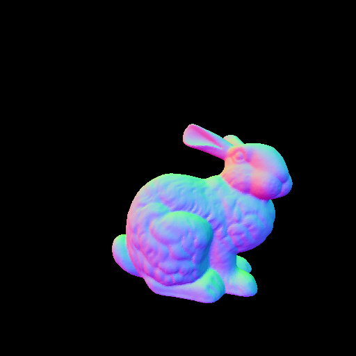
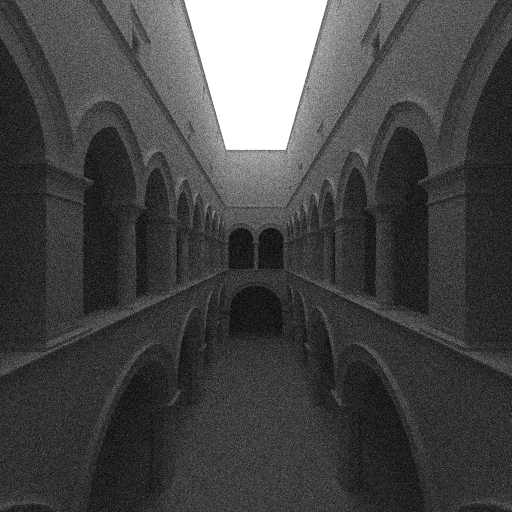

# lets-implement-bvh

[p-ray](https://p-ray.oskt.us/)のBVH実装会用のリポジトリ

## Requirements

* C++17
* CMake 3.12 or Higher
* OpenMP (一部のexampleを動かすのに必要)

## Build

```
git submodule update --init
mkdir build
cd build
cmake ..
make
```

## Examples

BVHを使う例が`example/`に含まれています。

使用しているobjファイルは https://casual-effects.com/data/ から入手できます。

|Name|Description|
|:--|:--|
|`example/simple-example`|objファイルからBVHを構築し, レイとの交差判定を行う最もシンプルな例|
|`example/simple-rendering`|objファイルの法線をレンダリングする例|
|`example/path-tracing`|objファイルをパストレーシングでレンダリングする例|

### simple-example

```
❯ ./example/simple-example/simple-example
vertices: 2613918
faces: 871306
nodes: 524287
internal nodes: 262143
leaf nodes: 262144
bbox: (-0.23978, -0.282958, -0.472247), (0.207395, 0.422022, 0.527753)
t: 9.66599
hitPos: (0, 0, -0.334008)
hitNormal: (0.0401587, 0.24409, -0.968921)
uv: 0.120652, 0.189789
barycentric: 0.120652, 0.189789
```

### simple-rendering



### path-tracing



## Externals

* [tinyobjloader/tinyobjloader](https://github.com/tinyobjloader/tinyobjloader)
